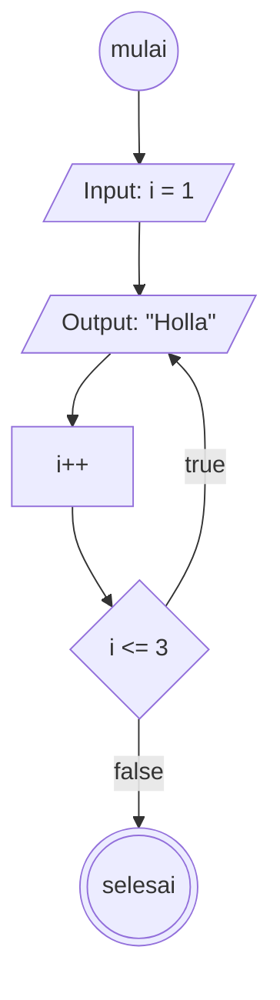

# Homework 1
## Flowchart do while

```mermaid
flowchart TD
    mulai@{ shape: circle}
    input@{ shape: lean-r, label: "Input: i = 1"}
    output@{ shape: lean-r, label: "Output: #quot;Holla#quot;"}
    iterasi@{ label: "i++"}
    if@{ shape: diamond, label: "i <= 3"}
    selesai@{ shape: dbl-circ}

mulai-->input-->output-->iterasi-->if
if--true-->output
if--false-->selesai

```
