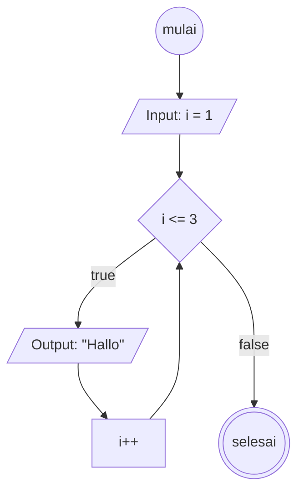

# Homework 1
## Flowchart for

```mermaid
flowchart TD
    mulai@{ shape: circle}
    input@{ shape: lean-r, label: "Input: i = 1"}
    if@{ shape: diamond, label: "i <= 3"}
    true@{ shape: lean-r, label: "Output: #quot;Hallo#quot;"}
    iterasi@{ label: "i++"}
    selesai@{ shape: dbl-circ}

mulai-->input-->if
if--true-->true-->iterasi-->if
if--false--->selesai
```